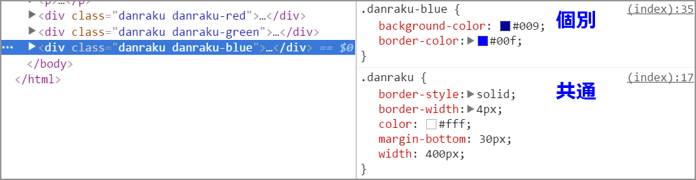

# 複数のクラスをひとつの要素に適用する

スペースで区切ることで複数のCSSクラスを適用できます。  
共通指定と個別指定をそれぞれ適用させることで、コード量の削減と読みやすさを実現できます。

ただし、必ずまとめなければならない、ということはありません。  
ひとつの要素に対するスタイル指定があまりに細切れにされてソースコード内に分散してしまうと、管理が面倒です。  
読みやすさを第一に考えて、クラス名を付ける際も、共通の「`danraku`」に対して赤色に配色する個別指定は「`danraku-red`」とするとなど、関係が分かりやすい名前にしてください。

- [デモ: index.html](http://sutara79.github.io/demo-multicss/)

